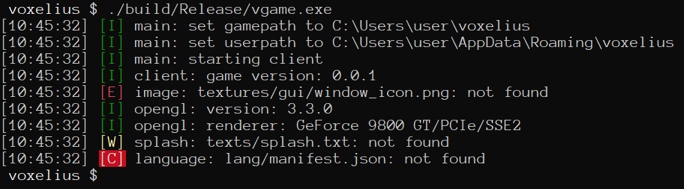
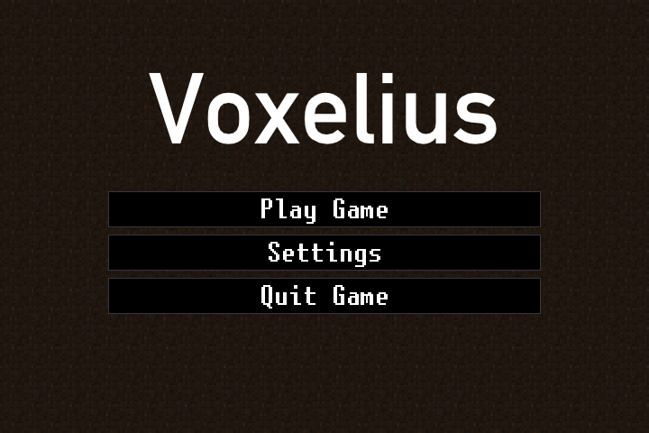
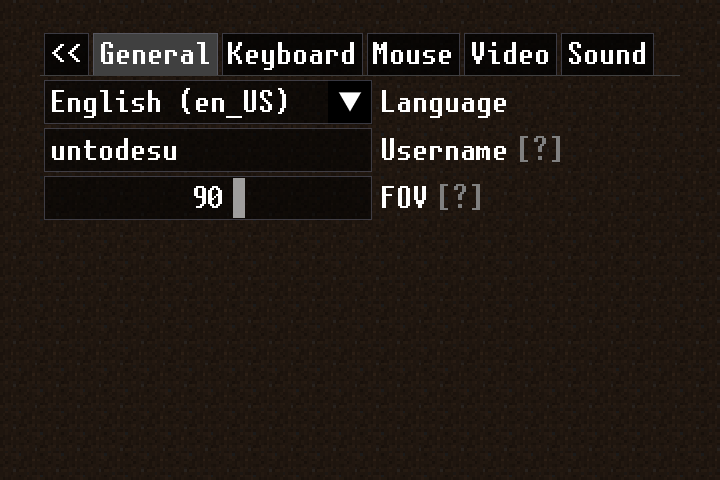
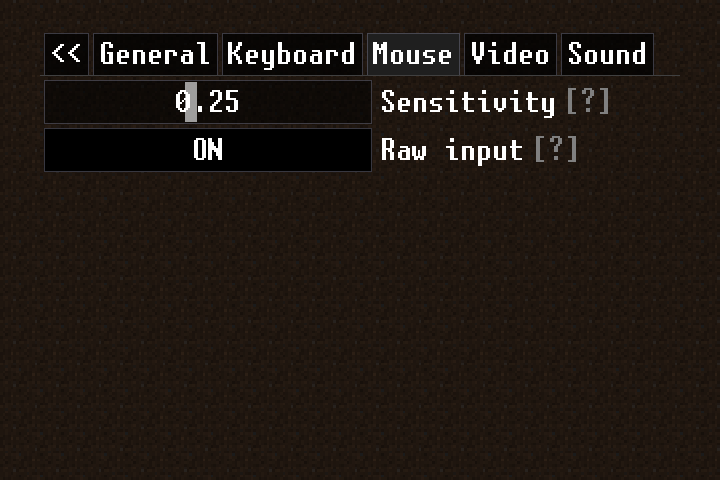
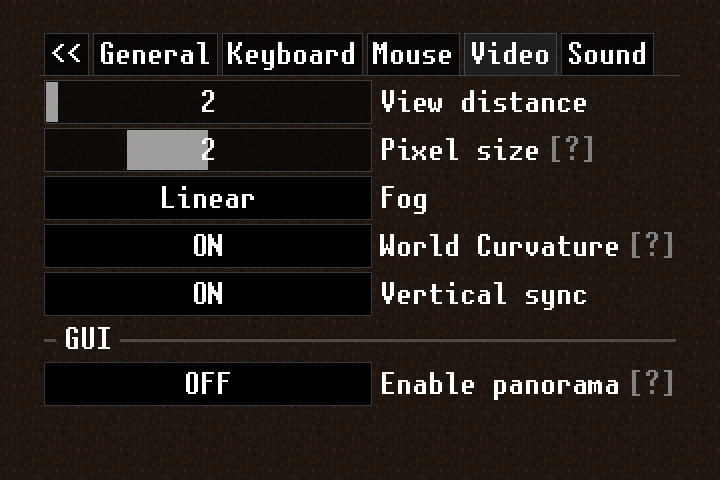
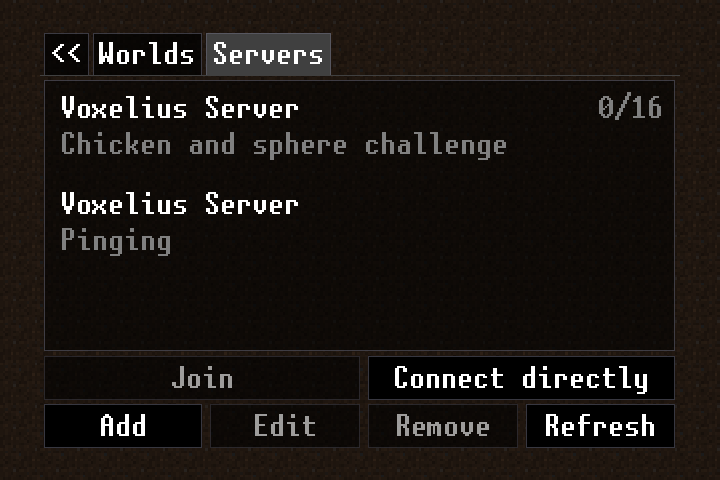

# Launching Voxelius
Because the game is in active development, straight up compiling and launching can be a little bit tricky because the game cannot figure out by itself where all the assets located at, throws out a bunch of error messages and dies:  


## Virtual file system
Voxelius uses [PhysFS](https://github.com/icculus/physfs) to manage assets using virtual root-based paths; however before the game runs, the library must be configured: mount points for content locations must be added, write directory must be set, etc etc.  

Voxelius in-code terminology slightly differs from what the VFS library uses:
* Write directory (the place where all the user-generated files and content are placed) is tagged in the source code as `userpath`  
* Read-only content mount points (places from where the game pulls content out by default) are tagged in the source code as `gamepath`  

By default Voxelius looks up these values for VFS exit points:  
|Platform|User path|Game path|  
|--------|---------|---------|  
|Windows|`%APPDATA%/voxelius`|CWD|  
|UNIX and UNIX-likes|`${HOME}/.voxelius`|`/usr/share/voxelius`|  

Users can override these locations with the following command line options:  
* `--userpath <path>`
* `--gamepath <path>`
* `--dev`

The `--dev` command line parameter is equivalent to `--gamepath ${PWD}/assets` and is intended for development/playtesting usage: it allows the game to run in-situ and pull assets out from the Git repository if the game is built [per-documentation](building.md)  

## Launching the game
Since packaging is not implemented yet, your best bet is to launch the game from command line. As usual, commands differ for both Windows and UNIX/UNIX-like systems:  

* Windows:  
  ```
  build\Debug\vgame.exe --dev
  build\Release\vgame.exe --dev
  ```
* UNIX and UNIX-likes:
  ```
  ./build/vgame --dev
  ```

If nothing goes wrong, you should see the game window pop up:  
  

You can play around with the game settings:  
  

Rebind some keys to your will:  
  

Setup your mouse input correctly:  
  

Make sure the game doesn't turn your GPU into a furnace:  
  

And finally join a server (single-player is TBD):  
  

